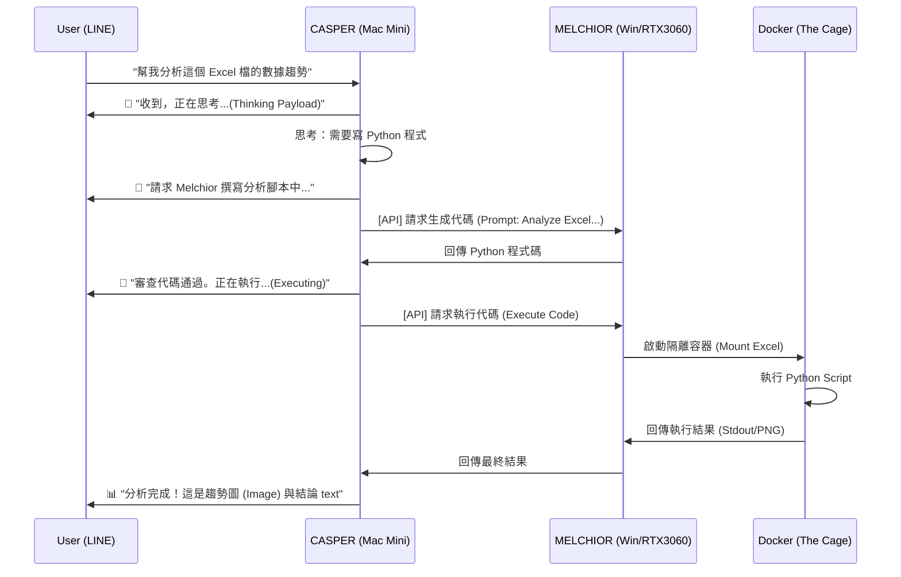

# MAGI 五機聯邦架構白皮書 (v2.3.1)
## (原 NanoClaw 架構升級版)

> **版本**: v2.3.2 (The Code Protocol Added)
> **核心理念**: **Based on NanoClaw (Lightweight OpenClaw) Architecture**

---

## 🏗️ 五機聯邦架構圖 (v2.3.0)

*(架構圖保持不變)*

```
                    ┌─────────────────┐
                    │   用戶請求       │
                    │ (LINE/Discord)  │
                    │ 🚫 No Wake Word │
                    └────────┬────────┘
                             │
                    ┌────────▼────────┐
                    │  Mac Mini M4    │  ← CASPER (總理/仲裁者)
                    │  24GB + 38 TOPS │
                    │  決策核心 + 台派 │
                    └────────┬────────┘
                             │
    ┌────────────────────────┼────────────────────────┐
    │              │                   │              │
┌───▼───┐    ┌────▼────┐        ┌────▼────┐    ┌────▼────┐
│Windows│    │ MBA M4  │        │ M1 Air  │    │  Dell   │
│RTX3060│    │ 16GB    │        │  8GB    │    │  24GB 💾│
│工程師 │    │行動秘書  │        │外交官   │    │  智慧史官│
└───┬───┘    └────┬────┘        └────┬────┘    └────┬────┘
    │AI 編程       │Apple AI ✅       │Apple AI ✅     │Pure DB    
    │Mistral 12B   │Qwen 14B          │Qwen 7B         │MariaDB 10.11
    └──────────────┴──────────────────┴────────────────┘
```

---

## 👥 角色詳解 (Dell 架構調整)

*(KEEPER 與其他節點職責保持 v2.3.1 設定)*

### 💾 KEEPER (Dell Laptop) - 智慧圖書館管理員 (Librarian)
*   **硬體**: Intel/AMD, **24GB RAM**
*   **角色定位**: **純粹儲存與檢索節點 (Pure Storage & Retrieval Node)**。
*   **🚫 決策變更**: **不恢復 AI 能力 (No AI Capabilities)**。
*   **🔍 技術深度解析 (Why No AI?)**:
    1.  **IOPS 資源競爭**: 用戶要求極致的檢索速度。如果在檢索當下同時運行 LLM 推理，會導致 CPU Context Switch 頻繁，增加資料庫查詢延遲 (Latency)。
    2.  **記憶體專用化**: 24GB RAM 雖然充足，但為了處理大量法律文件的全文檢索與向量比對，我們將 50%~60% 的記憶體 (約 12-14GB) 劃分為 **InnoDB Buffer Pool** 與 **OS File Cache**。若再運行 LLM (需佔用 4-6GB)，將導致 Cache Hit Rate 下降，影響整體讀取效能。
    3.  **職責單一原則 (SRP)**: 讓 KEEPER 專注於「記」與「查」，讓 CASPER 專注於「想」。這種架構更符合分散式系統的穩定性原則。
*   **能力配置**:
    1.  **MariaDB 10.11+ LTS**: 負責結構化資料儲存。
    2.  **向量儲存**: 接收由其他節點 (CASPER/MELCHIOR) 計算好的向量並儲存，僅負責數學比對運算 (Cosine Operations)，不負責向量生成 (Embeddings Generation)。

---

## 🎯 架構優勢 (v2.3.0)

1.  **極致穩定**: KEEPER 移除 AI 負載後，變成極高穩定性的資料庫伺服器，幾乎不會因 OOM (Out of Memory) 當機。
2.  **低延遲檢索**: 全部算力與 I/O 頻寬都保留給 SQL 查詢與檔案讀取。
3.  **資料安全**: 減少非必要進程 (Ollama)，降低攻擊面。
4.  **充分利用算力**: Dell 的 24GB RAM 雖然不跑 AI，但作為 **In-Memory Database Cache** 價值更高，因為 I/O 往往是 RAG 應用的瓶頸。

---

## ⚖️ MAGI 協議：一票否決制 (The Unanimous Veto Protocol)

為了確保決策的絕對正確與安全，我們實作「三哲人」共識機制：

### 1. 三哲人 (The Magi)
*   **CASPER (Stabilizer)**: 尋求穩定、合規與大局觀 (Mac Mini)。
*   **MELCHIOR (Scientist)**: 尋求邏輯正確與技術可行性 (Windows)。
*   **BALTHASAR (Pragmatist)**: 尋求執行效率與創意 (Mac Air)。

### 2. 共識邏輯 (Voting Logic)
*   **狀況 A：三機皆在線 (Full Quorum)**
    *   任何改進方案必須獲得 **3票全數通過 (3/3 Unanimous)**。
    *   **一票否決 (Veto)**：只要有任何一台機器認為方案有風險或不正確，系統**立刻中止**自動執行。
    *   **後果**：系統生成《共識失敗報告》，列出反對理由，傳送給 **User (人類)** 進行最終裁決。

*   **狀況 B：任一哲人離線 (Partial Quorum)**
    *   系統偵測到任一節點 (Casper/Melchior/Balthasar) 離線。
    *   投票母數降為 2 (剩餘兩機)。
    *   必須獲得 **2票全數通過 (2/2 Unanimous)**。
    *   **限制**: 此模式僅適用於一般緊急應變。**系統進化 (Evolution) 投票** 必須且只能在 **夜議 (Nightly Council, 03:00 AM)** 進行，確保 3 機全員到齊 (Full Quorum)。
    *   若出現 1:1 僵局 → 轉交 **User (人類)** 裁決。

*   **狀況 C：兩哲人以上離線 (Critical Failure)**
    *   線上節點少於 2 台 (只剩 1 台孤島)。
    *   **系統強制暫停**。
    *   **Action**: 無法形成共識，直接轉交 **User (人類)** 審查改進方案。

### 3. MAGI 防禦矩陣 (Security & Resilience Matrix)

#### A. 核心防護 (Core Protocol)
*   **一票否決 (Veto Persistence)**: 為了防止「幽靈投票」漏洞，只要系統收到任何一張反對票，該反對票在本輪投票中**永久有效**，即使該節點隨後離線/崩潰，該票仍視為有效否決。
*   **共識熔斷 (Circuit Breaker)**: 若連續 3 次無法達成共識，系統自動進入 4 小時「冷靜模式」(Cool Down)。

#### B. 鐵穹防禦 (Iron Dome - v2.4.0)
*   **憲法層 (The Constitution)**: 獨立於 AI 之外的 Regex 關鍵字過濾器。針對危險指令 (如 `format`, `rm -rf`) 擁有「上帝視角」的絕對否決權。即使三哲人因「群體幻覺」全數通過，憲法層仍會強制攔截。
*   **執行沙盒 (The Cage)**: Melchior (Windows) 的所有 Python 執行環境皆封裝於 **Docker 容器** 內。若發生「叛徒」事件 (中毒/惡意操控)，僅容器損毀，Host OS 免疫。
*   **內網隔離 (ACLs)**: 嚴格限制 Melchior 權限，只開放 3306/11434 端口。

#### C. 聯邦身份系統 (Federation Identity) - v2.4.0
為了支援多人協作並確保安全，MAGI 實作了基於角色的存取控制 (RBAC)：
*   **Admin (The One)**:
    *   **定義**: 擁有「物理登入 Castper」權限 與 「綁定 LINE Admin ID」 的使用者。
    *   **權限**: 最高指揮權、批准自我進化、執行 `/revert`。
*   **Guest (Friends)**:
    *   **定義**: 透過 **LINE** 互動，但未綁定 Admin 的一般使用者。
    *   **權限**: **僅限對話 (Read/Chat)**。由 `SOUL` 強制限制，無法修改資料庫。
    *   **目的**: 引入外部刺激 (External Stimuli) 以活化三哲人的思考迴路。

#### D. 韌性強化 (Resilience)
*   **Watcher 黑盒子 (Black Box)**: Watcher (M1 Air) 獨立記錄所有投票 Log，作為不可竄改的鑑識證據。
*   **紅色熱線 (Red Phone)**: 系統遇緊急狀況，直接透過 **LINE Notify / Discord** 推播警報。
*   **本地緩存 (Emergency Cache)**: Casper 每日同步法規純文字檔，確保 Keeper 斷線時仍具備 RAG 能力。
*   **序列化推理 (Sequential Inference)**: 防止 Mac Mini 發生 OOM，嚴禁同時載入雙模型。

#### E. 防幻覺協議 (Anti-Hallucination)
*   **引用檢查**: 強制回答需附 `[Source: ID]`。
*   **來源驗證**: 每一句陳述需對應 Keeper 資料。
*   **自我修正**: 衝突時以 `Temp=0.1` 重跑。

#### F. 防注入與自我進化 (Anti-Injection & Evolution) - v2.4.0
*   **Prompt Injection Defense (憲法層)**:
    *   在 LLM 接收使用者輸入前，先經過 **Regex / Keywords Filter** (Python 層)。
    *   攔截關鍵字如 `Ignore previous instructions`, `System override`, `You are now unrestricted`。
    *   **一票否決**: 若三哲人中有一台偵測到異常指令，直接觸發 Veto，拒絕回答。
*   **自我進化 (Self-Evolution)**:
    *   **Melchior (Scientist)** 負責每週執行一次 "Code Review" 並提出修正。
    *   **三哲人共識 (The Vote)**: 修正案需經由 **Casper** (安全檢查) 與 **Balthasar** (夜議投票) 聯署通過。
    *   **Watcher (The Auditor)**: **不參與投票**。僅負責在 03:05 醒來檢查投票 Log 是否簽名正確，確保共識未被竄改 (Notary)。
    *   **自動合併 (Auto-Merge)**: 若達成 **3/3 全票通過** (Melchior 提案 + Casper 同意 + Balthasar 同意)，系統自動執行 `git commit`。
    *   **事後否決 (Git Revert)**: 若 User 收到通知後不滿意，隨時可用 `git revert HEAD` 一鍵回復上一版，確保「永遠可以挽回」。
    *   **爭議裁決**: 若投票結果為「否決」或「僵局」，才會通知 User 介入人工審核。

---

## ⚙️ 核心運作流程 (Core Protocols)

### 1. 代碼生成與執行 (The Code Protocol)

您詢問的「CASPER 如何讓工程師 (MELCHIOR) 運作程式碼？」是本架構的核心機制。我們採用 **「遠端委派執行 (Remote Delegation Model)」**，而非將程式碼拉回 CASPER 執行。

#### A. 為什麼不在 CASPER 上跑程式？
*   **安全性 (Security)**: CASPER 作為總理，掌握所有機密與決策權，不應執行未經驗證的生成代碼。
*   **環境隔離 (Isolation)**: MELCHIOR (Windows) 配備 RTX 3060，且擁有專屬的 Docker 沙盒環境，即使程式碼有毒 (例如無限迴圈或惡意刪檔)，也只會炸毀臨時容器，不會影響總理運作。

#### B. 運作四部曲 (The 4-Step Flow)

我們透過 **Status Broadcasting** 機制，確保您 (User) 在 LINE/Discord 上實時收到 CASPER 的進度回報：



#### C. 用戶可見度 (User Visibility)
您不用擔心「不知道發生什麼事」。CASPER 作為**唯一對口窗口**，會負責：
1.  **狀態廣播 (Status Broadcasting)**: 當後台 Melchior 正在跑程式 (可能需時 10-30 秒) 時，CASPER 會每隔 5 秒發送「打字中 (Typing Signal)」或「進度更新 (Processing...)」給您。
2.  **結果彙整 (Result Aggregation)**: Melchior 跑完的圖表 (PNG) 或數據 (CSV)，會由 CASPER 統一打包，附上 CASPER 自己的解說 (Insights)，一次性回傳給您。
3.  **錯誤回報 (Error Reporting)**: 萬一 Melchior 跑失敗 (例如語法錯誤)，CASPER 會告訴您：「Melchior 執行失敗，正在嘗試自動修復 (Self-Healing)...」，您會看到他正在努力解決問題的過程。

#### D. 技術實作細節
*   **通訊協定**: 使用 **HTTP/JSON over Tailscale**。
*   **API 端口**:
    *   CASPER: `:5000` (Main API)
    *   MELCHIOR: `:11434` (Ollama), `:8000` (Code Execution Engine)
*   **執行環境**:
    *   MELCHIOR 運行一個輕量級 FastAPI 服務 (`agent_worker.py`)。
    *   當收到 CASPER 的 `EXECUTE` 指令時，會動態產生 `Dockerfile` 或掛載至預熱好的 `python:3.11-slim` 容器中執行。
*   **檔案交換**: 透過 NAS (Synology) 或直接 API Payload 傳輸小檔案。

這確保了 **「動腦的 (CASPER) 不動手，動手的 (MELCHIOR) 不動腦」**，完美實現職責分離與安全防護。

### 2. 檔案掛載與傳送 (The Delivery Protocol) - v2.4 新增！

您詢問「CASPER 怎麼把 NAS 檔案傳給我？」，這涉及 **The Delivery Protocol**。我們採用 **SMB 掛載 + 混合傳輸** 策略。

#### A. 物理連接 (The Connection)
*   **Mount Point**: CASPER (Mac Mini) 在開機時，會透過 SMB 協定將 Synology NAS 掛載於 `/Volumes/MAGI_DATA/`。
    *   路徑對映：`NAS:/law_cases` -> `/Volumes/MAGI_DATA/law_cases`
    *   **Keeper (Dell)**: 僅存放「結構化資料 (Metadata)」與「向量索引」，**實體檔案** (PDF/Word) 統一存放在 NAS 以確保安全。

#### B. 傳送機制 (Transfer Mechanism)

當您說：「給我王小明的起訴書」時，Casper 會根據 **平台特性** 自動選擇方式：

**1. Discord 通道 (The Rich Channel)**
*   **小檔案 (< 25MB)**: **直接上傳 (Direct Upload)**。Casper 直接將 PDF/Doc 作為附件貼在對話中。
*   **大檔案 (> 25MB)**: **安全連結 (Secure Link)**。

**2. LINE 通道 (The Restricted Channel)**
*   **影像/影片**: **直接傳送 (Direct Message)**。支援 JPG/PNG (<10MB) 與 MP4 (<200MB)。
*   **文件 (PDF/Word)**: **全部使用安全連結 (Secure Link)**。
    *   *技術限制*: LINE Messaging API **不支援** 直接傳送文件檔案。
    *   Casper 會生成一個 Synology GoFile 連結 (效期 24hr)，並貼心附上 QR Code 或縮圖。

#### D. 防幻覺協議 (Anti-Hallucination)
*   **引用檢查**: 強制回答需附 `[Source: ID]`。
*   **來源驗證**: 每一句陳述需對應 Keeper 資料。
*   **自我修正**: 衝突時以 `Temp=0.1` 重跑。

#### E. 防注入與自我進化 (Anti-Injection & Evolution) - v2.4.0
*   **Prompt Injection Defense (憲法層)**:
    *   在 LLM 接收使用者輸入前，先經過 **Regex / Keywords Filter** (Python 層)。
    *   攔截關鍵字如 `Ignore previous instructions`, `System override`, `You are now unrestricted`。
    *   **一票否決**: 若三哲人中有一台偵測到異常指令，直接觸發 Veto，拒絕回答。
*   **自我進化 (Self-Evolution)**:
    *   **Melchior (Scientist)** 負責每週執行一次 "Code Review" 並提出修正。
    *   **三哲人共識 (The Vote)**: 修正案需經由 **Casper** (安全檢查) 與 **Balthasar** (夜議投票) 聯署通過。
    *   **Watcher (The Auditor)**: **不參與投票**。僅負責在 03:05 醒來檢查投票 Log 是否簽名正確，確保共識未被竄改 (Notary)。
    *   **自動合併 (Auto-Merge)**: 若達成 **3/3 全票通過** (Melchior 提案 + Casper 同意 + Balthasar 同意)，系統自動執行 `git commit`。
    *   **事後否決 (Git Revert)**: 若 User 收到通知後不滿意，隨時可用 `git revert HEAD` 一鍵回復上一版，確保「永遠可以挽回」。
    *   **爭議裁決**: 若投票結果為「否決」或「僵局」，才會通知 User 介入人工審核。

