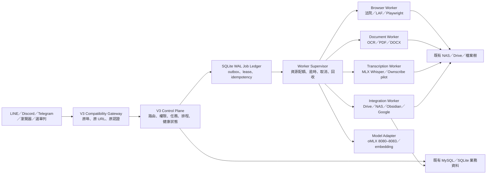

# MAGI V3 取代式架構設計

狀態：可開始實作的基準設計  
日期：2026-07-14  
最終目標：V3 完整取代 V2。切換前只有 V2 提供 production；切換後只有 V3 提供 production，V2 僅以已停止的 release 與狀態快照保留冷回復能力。

資源、Agent Kernel、快慢路徑與效能門檻已由 `MAGI_V3_PERFORMANCE_FIRST.md` Revision 2 取代本文件較早的概略預算；兩者衝突時以 Revision 2 與 `config/v3_resource_policy.json` 為準。

## 1. 不可妥協的條件

1. 現行功能在遷移期間不得中斷，使用者入口、埠號、資料位置及主要輸出格式保持相容。
2. V3 不以 README 當功能清單；相容基線由程式路由、skill 入口、排程、daemon、LaunchAgent 與測試自動產生。
3. V3 在離線測試、歷史流量重播與隔離 LIVE 驗證全部完成前不得接管 production；不採 V2/V3 capability 分流、deployment shadow 或 deployment canary。
4. 正式全域切換只在 Asia/Taipei 02:00–04:00 維護窗執行，而且所有驗收閘門必須先通過。
5. 切換採 single-active 冷切換：先進入短暫維護、drain V2，再完整停止 V2，確認入口、排程、writer、browser、model owner 與背景程序均已釋放，才啟動 V3。不得以「零中斷」為由讓兩版重疊。
6. 切換後 V2 release 與相容狀態快照至少保留七日，但所有 V2 程序維持停止。回復時先完整停止 V3，再啟動 V2，兩版不得同時運作。

## 2. 經程式驗證的 V2 基線

`scripts/architecture/generate_v2_inventory.py` 直接分析可執行來源，目前快照為：

- 靜態分析可辨識 335 個 HTTP route；安全載入實際 Flask `app.url_map` 為 342 個非 static route（5002 主服務 275、5003 Tools API 67）。runtime 342 條是 authoritative hard gate。
- 51 個 active `skills/**/action.py` 能力入口，另有 15 個版本化 rollback artifact；兩者都須保留。
- 102 個排程定義，其中 92 個啟用；停用項目也必須保留設定與歷史狀態。
- 6 個 daemon 直接子程序宣告。
- 7 個版本庫內 LaunchAgent 定義，以及本機實際安裝的 26 個 `com.magi.*` LaunchAgent。
- 457 個 `tests/test_*.py` 測試模組（含本次新增的 V3 inventory guard）。

完整機器可讀快照位於 `generated/v2_inventory.json`。這些數字是介面覆蓋下限，不代表只要數量相等就達成語意相容；每個重要流程仍須以黃金資料與副作用對帳驗證。

## 3. 目標拓撲



### 3.1 Compatibility Gateway

- Compatibility Gateway 是 V3 release 內部元件，不會在 V2 production 前方先行常駐。切換前原埠與全部 production 流量只由 V2 持有；切換後才由 V3 在相同外部介面接管。
- 維持 5002、5003、5014 等現有外部介面；模型服務的 8080–8083 仍由 model adapter 使用。
- 342 條 runtime route、SSE、multipart、plaintext、auth、錯誤碼及寫入冪等，全部先以離線 contract test、錄製流量重播與隔離環境驗證。
- 不做 production 的 capability 分流：切換前全部走 V2，切換後全部走 V3。`V2 compatibility` 指 V3 保留 V2 path/body/response 契約，不是代理到仍在運作的 V2 backend。
- 具副作用的驗證使用複製資料、dry-run、sandbox 或專用測試帳號，不得對法院、Google、NAS 或訊息通道重複寫入。切換後若 V3 失敗，執行整版冷回復，不在單一要求中自動 fallback 到 V2。

### 3.2 輕量 Control Plane

常駐程序只負責：認證授權、路由、任務狀態、排程、資源仲裁、事件紀錄與輕量健康檢查。禁止在 import 階段載入 PyTorch、MLX、Whisper、OCR framework、Playwright browser、PyMuPDF 或大型向量索引。

Control Plane 使用獨立 SQLite WAL ledger 保存任務、lease、attempt、outbox 與切換狀態。它不是新的業務資料庫；案件、帳務、待辦、記憶及檔案仍以現有 canonical store 為準，避免全域切換同時搬動所有資料。

### 3.3 一次一工作程序的 Worker

每種重工作業使用隔離環境與程序。預設一項工作完成即退出；經量測確實有利的模型程序可保留短 TTL，但需受 supervisor 回收。

| Worker class | 內容 | 預設同時數 | 初始 RSS 上限 | 退出條件 |
|---|---|---:|---:|---|
| `light` | 小型轉換、通知組裝 | min=0/max=2 | 128 MB／process | 20 jobs 或 idle 60 秒退出 |
| `browser` | 法院、LAF、Playwright | 全域 1 | 1.5 GB | 每案/批次結束，browser 必關閉 |
| `document` | OCR、PDF、Office | 1 | 2.5 GB | 完成即退出 |
| `transcription` | Whisper、diarization | 1 | 3 GB（不含模型檔） | 完成即退出 |
| `integration` | Drive、NAS、Obsidian、Google | 1 | 768 MB | 批次 checkpoint 後退出 |
| `model` | oMLX adapter | 1 個重推理租約 | 由 model registry 決定 | TTL 卸載模型 |
| `maintenance` | 備份、清理、稽核、測試 | 1 | 768 MB | 完成即退出 |

上限是第一版保護值，實作前以這台電腦的壓測校正。資源 governor 依 memory pressure、Metal footprint、swap 趨勢和前景互動決定是否發 lease；不會因 swap 曾經使用過就誤殺服務。輸入法與 WindowServer 列為保留資源，壓力升高時先暫緩背景重工作業。

上述 class 上限不可相加後同時發 lease。全機只有一個 global heavy token、一個 browser token；互動期間 background heavy/browser 都是 0。release core idle ≤256 MB、MAGI deep idle ≤512 MB，並保留至少 8 GB 給前景程式。

業務 worker 再細分為 `court-portal`、`laf-portal`、`transcript-portal`、`mail`、`judicial-ingest`、`case-file`、`notification-outbox`、`health-reconciliation` 八條 lane。三個 portal lane 共用全域 browser token，但各有自己的 domain lock；mail 不得開 browser；業務 worker 只寫 notification outbox，不直接多通道發送。

### 3.4 統一任務契約

所有 worker 接受並回傳 `contracts/job-envelope.schema.json`。終態明確區分：

- `succeeded`：工作及必要副作用完成，且 `business_completed=true`。只把子工作排入 queue 時，父工作必須維持 `waiting_children`。
- `failed`：確定失敗；含穩定 error code 與是否可重試。
- `deferred`：資源、憑證或外部服務暫不可用，尚未執行完整工作；不顯示為系統故障。
- `skipped`：依規則判定無需執行，例如檔案已存在且雜湊相同。
- `cancelled`：使用者或系統取消，不能混成 failed。
- `timed_out`：超時終止，worker 必須釋放子程序、browser、暫存檔與 lease。
- `needs_confirmation`／`awaiting_input`：等待人工確認或必要資料，不得混成 success 或 failure。

每項具副作用的工作必須有 idempotency key。任務 lease 逾期可被接手，但只有未提交 outbox 的工作能自動重跑。外部副作用使用 transactional outbox 或「準備／提交／確認」三階段記錄。

V2 已實際出現「閱卷排入背景下載即被排程記為 success，但背景工作約七分鐘後才完成」的語意缺口。V3 parent run 必須聚合 child run、artifact 與 side-effect receipt 後才能完成，排程 UI 也要分開顯示 accepted、running、waiting 與 business completed。

### 3.5 資料與檔案策略

- 案件、帳務、待辦等業務資料：初期直接使用現有 MySQL schema，由 repository adapter 封裝；禁止 V2/V3 各自維護一份真相。
- `magi.db`、`law_firm.db` 與各 JSON state：先建立 ownership 表，逐檔指定唯一 writer；V3 測試只讀複製快照或寫隔離目錄。
- NAS／Drive：沿用既有案件路徑與檔名規則；寫入採 staging、fsync、原子 rename。跨檔案系統移動使用 copy + hash verify + rename，不能假設 rename 原子性。
- runtime：V3 使用獨立 `Application Support/MAGI/runtime/MAGI_v3`，不得 import V2 runtime tree。共享的只有明確列入契約的 DB、檔案根與模型服務。
- secrets：延續 Keychain／環境注入，但 worker 只收到該操作需要的最小憑證，不複製整份 `.env`。

## 4. 功能邊界與完整保留

V3 必須涵蓋下列 16 個 capability domain；詳細證據與驗收方法見 `V2_FEATURE_PARITY.md`：

1. LINE、Discord、Telegram 與 web callback。
2. OSC 案件、檔案、待辦與搜尋。
3. 帳務、債務、Google Calendar。
4. 法扶 LAF 信件、案件建立、條件／進度草稿、入口網站流程。
5. 閱卷檢查、下載、歸檔、重試、鎖與排程。
6. 裁判書、法規、司法搜尋與研究摘要。
7. PDF 命名、書籤、註解、OCR、Office 文件處理。
8. 錄音、逐字稿、時間戳、語者、翻譯與摘要。
9. 記憶、向量、知識圖譜、Obsidian 與逐字稿索引。
10. NERV／三哲人、agent routing、模型切換與 embeddings。
11. skills 列舉、執行、教學、安裝、版本、canary 與 rollback。
12. 102 項排程的定義、狀態、逾時、資源延後、catch-up 與監控。
13. Drive／NAS 雙向同步、備份、清理與衝突治理。
14. Dashboard、Admin runtime、OSC web、選單列及行動入口。
15. health/readiness、watchdog、輸入法保護、日誌輪替、資安與稽核。
16. 外部 API、分享 gateway／tunnel、RPC 與 Tailscale 可用性。

任何新增的 V2 route、skill、cron 或 LaunchAgent 都會讓 inventory check 失敗，必須同步新增 V3 parity 項目或明確標記 retired 並取得人工核准。V2 runtime 與 source 的排程 timeout/config drift 也必須阻止部署；目前已確認 Drive all-files timeout 在 source 為 2100 秒、deployed runtime 為 5400 秒，且 live definition 曾混入 runtime evidence，V3 要把 immutable definition 與 run state 徹底分離。

## 5. Ownscribe 的位置

Ownscribe 不進 Control Plane，也不安裝到 V3 共用環境。它只能作為 transcription worker 的可選 backend：

- Swift CoreAudio helper 由 MAGI 自行建置、簽章、固定 checksum，禁止執行時下載未知 binary。
- 第一個試驗 backend 為 SenseVoice + CAM++，獨立 Python 3.12/3.13 環境；現有 MLX Whisper 保持 primary，直到中文法律錄音 benchmark 通過。
- Breeze 約 15 GB、FireRed 的硬編碼路徑／全域 monkey patch、FunASR 的全域 logger/tqdm 修改，不得進主程序。
- 輸出正規化為文字、segments、timestamp、speaker、word confidence、低信心區段及資源 metrics，再由 V3 內的 legacy-contract adapter 轉為現行回傳格式。

## 6. 部署與原子切換

V3 發行物採不可變版本目錄：

```text
Application Support/MAGI/
  releases/v3-YYYYMMDD-HHMM-<sha>/
  runtime/MAGI_v3/
  current-v3 -> releases/v3-.../
  previous-v3 -> releases/v3-.../
```

LaunchAgent 分成 gateway、control、supervisor 三個固定 label；worker 由 supervisor 建立，不為每種工作建立永久 daemon。部署只新增未啟動的 release，通過所有驗證後才在維護窗原子更新 production release pointer，不直接覆寫 live source。

V2 與 V3 禁止同時啟動完整或部分 production daemon。V2 process guardian 目前只用 `api/server.py` 等命令片段清程序，可能跨 root 誤殺；排程鎖位於各自 root，會讓兩版都取得 owner；oMLX profile、labels 與 watchdog 是 host singleton。因此切換工具必須以 release root、namespace、pidfile、port 與 ownership lease 驗證交接，且在 V2 尚未完全停止時拒絕啟動 V3 production。

MariaDB、NAS mount、RPC、8080/8081 模型服務及 input-method/memory/oMLX watchdog 定義為 version-neutral host infrastructure，不隨 release 重複啟動。V3 的離線與隔離 LIVE 驗證使用獨立 runtime、`.agent`、SQLite、queue、log、upload、cache、browser profile及複製資料；不得取得 production ingress、cron、webhook/Discord consumer、file watcher、writer、model switch 或 model watchdog ownership。host 模型 footprint 必須採 Metal-aware 數值，不能只看 RSS。

目前 production 執行的是 `Application Support/MAGI/runtime/MAGI_v2`，不是 Desktop source；兩棵樹不是 symlink。實測 1,898 個 tracked files 中有 30 個內容不同、17 個 runtime 缺少，mutable runtime 約 1.7 GiB。V3 deploy 不得整樹 rsync，更不得覆蓋 `.runtime`、`.agent`、`.env`、queue、browser profile 或 cron state。現有版本庫內僅有 7 個 LaunchAgent 定義，卻安裝了 26 個 MAGI plist；V3 installer 必須保存完整 rendered plist、checksum、release id 與卸載清單，才能重現與回退。

### Single-active 驗證與切換原則

1. V2 在正式切換前始終是唯一 production release；不先把 V3 gateway 放到 V2 前方，也不把流量分給兩個版本。
2. V3 的 unit、contract、integration、e2e、fault injection、效能與歷史流量重播使用 fixtures、錄製要求、複製 DB/state、mock/sandbox 外部系統完成。
3. LIVE 驗證只能是受控、一次性、完成即退出的 V3 command/process。若在同一台 Mac 執行，先進入獨立驗證維護窗並完整停止 V2，確認 owner 清空後才啟動 V3；驗證完完整停止 V3，才恢復 V2。兩版在 LIVE 驗證期間也不得重疊。production ingress、scheduler、consumer、writer 與 model owner 預設關閉，只以核准的測試入口與 sandbox/唯讀 probe 驗證。
4. 所有測試與上述 single-active LIVE 驗證完成、V2 已恢復為唯一 production 後，才安排最終離峰切換；屆時再次 drain 並完整停止 V2，確認 V2 PID、port、lease、排程、writer、browser 與 release-owned model owner全部清空，再原子切換 release pointer 並啟動 V3。
5. 切換後只有 V3 持有原 5002/5003/8088、production labels 與 ownership lease。回復時順序相反：完整停止 V3、確認資源釋放、還原 V2 pointer/state，再只啟動 V2。

這個流程刻意接受短暫、可觀測的維護中斷，以換取明確的唯一 owner 與可逆性；任何 preflight 若發現另一版本仍在運作，都必須自動 No-Go。

### 半夜正式切換 runbook

可機器檢查的門檻定義在 `config/v3_cutover_gates.json`；任一 required evidence 缺少即 No-Go，不允許以人工口頭決定略過 hard gate。

因 02:00–04:00 原本就是排程密集窗，cutover 日從 01:30–04:15 對 P2/P3/P4 啟用 maintenance blackout，01:45 後不得啟動 heavy；必要 P2 先執行一次，04:15 後只 stagger catch-up 最新的 read occurrence。

1. T-24h：凍結 V2/V3 新功能；inventory、全測試、黃金流程、效能、安全、離線重播與隔離 LIVE 驗證全部完成且全綠。未完成的驗證不得留到切換後補做。
2. T-30m：完成 DB/state backup 與 restore drill；確認 V2 healthy、V3 release checksum 固定且尚未啟動 production daemon，啟用 maintenance blackout。
3. T-5m：停止接收新的長工作，drain 既有工作；尚未提交的要求持久化，UI/訊息入口顯示短暫維護。對帳 job/outbox、cron cursor 與唯一 writer。
4. T0：取得全域 cutover lock，停止 V2 ingress、scheduler、workers、daemon 與 release-owned background process，bootout V2 labels。
5. T+1m：確認 V2 PID 為零，5002/5003/8088 已釋放，沒有 V2 scheduler/writer/browser/model owner；任一殘留即 No-Go 並只恢復 V2。
6. T+2m：原子更新 production release pointer 與 rendered plist，啟動 V3 一次，讓 V3 接管相同 port、labels 與 ownership lease。
7. T+2–10m：執行 post-cutover smoke，確認 login、訊息、案件讀取、排程狀態、模型、OCR、逐字稿及一組可回復寫入。這是啟動確認，不取代切換前已完成的 LIVE 驗證。
8. 任一 hard gate 失敗：完整停止 V3，確認 V3 PID/port/lease/writer/scheduler 均已釋放，原子還原 V2 release pointer 與相容狀態，只啟動 V2，並產生對帳報告。
9. T+30m：若仍全綠，結束維護窗；V2 release 與快照至少保留七日，但 V2 程序維持停止。

維護窗內會有一段刻意的服務暫停；不宣稱無縫切換，也不以背景佇列或 gateway 為理由同時維持兩版。已提交工作不得遺失或重複，未提交的新要求應明確收到維護狀態並安全重試。

## 7. Promotion 與回退閘門

一個 capability 只有同時滿足以下條件才能升級：

- Contract：輸入驗證、輸出 schema、錯誤碼、狀態與權限 100% 相容。
- Golden：正常、空結果、重複輸入、外部故障、取消、超時、重啟恢復全部通過。
- Side-effect：DB row、檔案雜湊、外部草稿／訊息／Drive action 與 V2 一致，無重複副作用。
- Performance：相同 workload 的業務 p95 最多比 V2 慢 5%、gateway 額外 p95 ≤5 ms、model throughput ≥V2 95%；application-plane footprint 至少下降 25%，worker process group/footprint/Metal 回收通過。
- Stability：至少連續七日離線重播／soak 無未解 diff，且至少三次隔離 LIVE 驗證無 P0/P1；所有驗證程序結束後不得留有 daemon 或 production owner。
- Operations：dashboard 能分辨服務故障、單項工作失敗、deferred、skipped；黃燈不再只因歷史單次失敗永久存在。
- Rollback：在測試環境實際演練 single-active 冷回復，RTO ≤ 2 分鐘；先停 V3、確認 owner 清空、再啟動 V2，未提交工作零遺失，已提交工作零重複。

全域切換的額外 hard gate：runtime 342 route、51 個 active skill 與 15 個 rollback artifact、102 cron、所有現行 LaunchAgent 職責皆已映射；V2 既有測試加 V3 contract/e2e 全數通過；backup restore drill 通過；不存在未確認的 dual writer，且切換器能證明同時 active release 數永遠不超過一。

## 8. 實作順序

1. 建立 inventory CI gate、capability manifest、job envelope 與 compatibility test harness。
2. 建立 V3 compatibility edge 與 342 route contract harness；只在測試環境驗證，不放到 V2 production 前方。
3. 建立 control plane、ledger、supervisor、resource governor，以錄製的 V2 trace 離線模擬，不承接 production 工作。
4. 先遷移純讀取／純運算：health metadata、格式轉換、搜尋聚合。
5. 遷移 transcription、OCR/PDF 等可隔離重工作業，驗證記憶體確實釋放。
6. 遷移 Drive/NAS/Obsidian 與排程，加入 checkpoint、idempotency、outbox。
7. 最後遷移法院與 LAF browser 流程，以及 OSC/帳務等高風險寫入。
8. 完成全量離線 replay/soak 與隔離 LIVE 驗證後，在半夜 single-active 冷切換；V2 立即維持停止，七日觀察期間只保留可冷回復的 release 與快照。

## 9. 明確不採用的方式

- 不直接把 V2 大模組 import 到 V3 control plane；那只會把記憶體與 side effect 問題搬過去。
- 不以 Docker/Kubernetes 作為這台 Mac 的先決條件；launchd + 隔離 venv + subprocess 足以提供本機故障邊界，且額外負擔更低。
- 不在切換夜同時更換業務 DB schema、檔案命名規則、模型與所有外部憑證。
- 不讓 V2/V3 production service、scheduler、consumer、writer 或 release-owned background process 在任何時刻重疊；包括切換與回復。
- 不做無 idempotency 的自動 fallback 寫入。
- 不以「程序還活著」當功能健康；readiness 必須是輕量且不載入模型，業務功能由定期 contract probe 驗證。

此設計讓 V2 在開發與驗證期維持所有現有 production 功能；V3 完成驗證後以一次 single-active 冷切換完整接管。磁碟上可同時保留兩個 release，但執行中的 MAGI 永遠只有一版。
