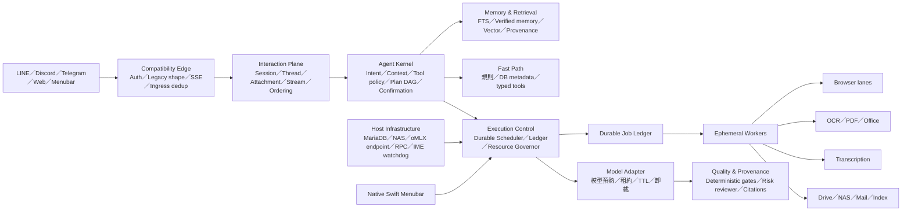

# MAGI V3 效能優先整體設計（Revision 2）

狀態：取代原設計中的資源與 Agent runtime 部分，功能相容、資料、切換與回退規則仍沿用 `MAGI_V3_ARCHITECTURE.md`。  
硬體目標：Apple M4、10 CPU cores、10 GPU cores、24 GB unified memory。  
產品目標：MAGI 平常近乎無感，需要時維持 V2 的速度與品質，正式法律工作比 V2 更可靠。

## 1. 重新定義成功

V3 只有同時滿足以下四項才算成功：

1. 功能完整：342 條 runtime route、51 個 active skill、15 個 rollback artifact、102 個 cron 與 26 個現行 LaunchAgent 職責都有對應。
2. 平常輕量：deep idle 不載入模型、OCR、Whisper、Playwright、FAISS full index；V3 release 常駐 footprint 不超過 256 MB，整體 MAGI idle 不超過 512 MB。
3. 使用時不變慢：warm chat TTFT p95 最多比 V2 慢 5%，tokens/sec 最多下降 3%，batch throughput 最多下降 5%；任務成功率與法律品質不得下降。
4. 不拖垮 Mac：前景程式、WindowServer 與輸入法永遠保留 8 GB headroom；interactive 可搶占所有背景重工作業，critical pressure 下 30 秒內回收 worker 與模型。

「省記憶體」不能靠換成較差模型、縮短必要上下文、跳過法律品質檢查或把工作偷偷 deferred 達成。資源改善必須來自減少常駐、避免重複工作、按風險使用模型、限制並發、工作完成後確實釋放資源。

## 2. 這台 Mac 的實際基線

2026-07-14 的只讀量測：

| 項目 | 實測 |
|---|---:|
| 主機 | Mac mini M4，24 GB unified memory |
| memory pressure free | 81% |
| 已使用 swap | 約 1.0 GB |
| MAGI／oMLX 相關程序 RSS 合計 | 約 2.84 GB |
| 8080 主模型程序 RSS | 約 2.10 GB |
| 8080 主模型實體 footprint | 約 5.90 GB |
| Main API footprint | 約 201 MB |
| Discord footprint | 約 87 MB |
| Tools API footprint | 約 65 MB |
| Menubar footprint | 約 100 MB |
| unloaded embed/Phi/Smol shell | 各約 97–98 MB footprint |
| 5002 `/livez` | 約 3 ms |
| 5002 `/readyz` | 約 48 ms |
| 5003 `/livez` | 約 2 ms |

目前 memory pressure 尚健康，不代表架構輕量。主模型一旦載入就占約 5.9 GB 實體 footprint；API、Discord、Tools、menubar、daemon、heartbeat、watchdog 與多個模型 shell 又各自常駐。這種設計會減少 Edge、Codex、Word、LINE、輸入法等前景程式可用空間，也讓多個背景 job 同時到期時更容易出現壓縮、swap 與輸入延遲。

另一個重要缺口是現有歷史 metrics 多次把 `summary_p95_sec` 記成 0，無法證明真實速度未下降。V3 實作的第一步不是搬功能，而是建立可信的 TTFT、tokens/sec、queue、task duration、peak footprint、Metal、quality 與 business completion 基線。

## 3. 修正後的常駐拓撲

### 3.1 `magi-core`

單一輕量常駐程序合併 compatibility edge、interaction plane、Agent Kernel、route manifest、durable scheduler、job ledger、resource governor 與 metadata health。它只保留輕量狀態與決策，不執行 OCR、模型、browser、PDF、大型檢索或 DB 掃描。

第一版維持 Python，以減少跨語言重寫和新的 bug 面，但採最小 ASGI/stdlib 依賴、嚴格 import allowlist，不能 import V2 Flask app 或 heavy framework。若實測無法把 core 壓在 128 MB footprint 內，才以相同 contract 評估 Go core；不預先為了「看起來輕」引入另一套語言與維護負擔。

Discord gateway 因 SDK 與長連線可保留一個隔離 channel adapter；LINE／Telegram webhook 經 core。Website Admin 合併到靜態 UI/query API。Python menubar 改為小型 Swift/AppKit client，只讀 core 的 public status，不再載入 MAGI Python runtime。

目標常駐：core ≤128 MB、channel adapter ≤80 MB、native menubar ≤30 MB；加上必要共享與量測誤差，release group hard cap 256 MB。

### 3.2 Interaction Plane 與 Agent Kernel

Agent 不能被簡化成 gateway 加 job queue。常駐的 Interaction Plane 保存 session/channel/thread identity、ingress dedup、recent attachment、response ordering 與 stream/progress cursor；Agent Kernel 執行 deterministic intent、Context Assembler、Memory/Tool Policy、immutable WorkflowPlan DAG、confirmation 與 side-effect decision。

這兩層只操作 typed contract、SQLite metadata 與小型 bounded cache，不載模型或 full vector index。每次執行要固定 `context_snapshot_id`、`plan_id/revision`、`used_context_ids`，避免一次性 worker 各自重組出不同上下文。DAG 必須拒絕 cycle、缺少 dependency 與非法 transition；read-only siblings 可平行，但 write step 依 confirmation/outbox 排序。

Context 優先序固定為：policy → current request → pending/confirmation → authoritative facts → recent raw → artifact excerpts → derived non-authoritative summary。Prompt view 可以裁切，raw event store 不可因 token budget被刪除。

### 3.3 Memory、Retrieval、Quality 與 Provenance

Memory 分成 raw session/event、verified memory、assistant utterance、artifact index 四個 namespace。Casual chat 不查全庫；案件問題先 case scope，再 parallel fulltext/vector；embedding 不可用時退 fulltext。assistant/degraded/synthetic/summary-derived 內容不得升級為長期事實，每筆 memory 都要有 source、trust、confidence、expiry 與 content hash。

便宜的 TW wording、gibberish、prompt/tool leak、拒答、source-term 與格式 gate inline 執行；只有正式法律、翻譯、OCR 衝突或低信心才啟動 reviewer。答案交付前形成 Answer Envelope，包含 citations、tool route、used context、quality verdict、source coverage 與各階段 latency。worker succeeded 不等於答案可交付。

### 3.4 Host infrastructure 不重複

MariaDB、NAS mount、RPC、8080/8081 oMLX endpoint、input-method／memory／oMLX watchdog 屬於主機，不屬於 V2 或 V3 release。V3 不再常駐 Phi/Smol reviewer shell；需要正式審查時才啟動，完成即卸載／退出。MTP 保持選配且預設關閉。

### 3.5 Ephemeral worker

重工作業維持一次一 process；light worker 使用 `min=0, max=2` 的短 TTL pool，每個最多處理 20 jobs 或 idle 60 秒；只有實測 cold-start 成本高且無 leak 的重 worker 才能保留最多五分鐘 warm TTL。所有 worker 必須：

- 有 process group、deadline、heartbeat、peak RSS/footprint/Metal 與 cancellation receipt。
- checkpoint 後才能被搶占；逾時要終止自己的 process tree，不能只讓 Future timeout。
- 完成後關閉 browser、檔案、DB、executor，30 秒內 footprint 回到執行前基線。
- cache 有 byte/entry/TTL 上限，不允許 module global 無界 dict/list/deque。
- 背景工作以 macOS background QoS／較低 nice 執行，不跟前景輸入搶 P-core。

## 4. 四種運作模式

### Deep idle

- core、必要 channel adapter、native menubar 存活。
- oMLX endpoint 可存活但模型 unloaded；reviewer、embedding、OCR、Whisper、FAISS full index、browser 全部未載入。
- 不跑重 indexing；cron 只建立 durable due record，不直接開始工作。
- release footprint ≤256 MB；整體 MAGI idle ≤512 MB；平均 CPU ≤1%。

### Interactive

- 使用者要求永遠 priority 100，立即暫緩 batch、index、OCR 與 portal browser lease。
- 快路徑先回覆；確需 LLM 時只載一個 primary model。
- primary model 在真實使用後保溫 10 分鐘，連續對話可延長到 30 分鐘；health、排程 probe、dashboard refresh 不能延長 TTL。
- 互動期間背景 heavy worker=0、browser=0，確保模型與 UI 不互搶 unified memory／GPU。

### Scheduled batch

- cron 先進 ledger；resource governor 依 deadline、業務重要性和資源發 lease。
- 全機同時最多一個 heavy worker、一個 browser worker；若兩者都可能吃大量記憶體，仍只放行一個。
- 已知需要模型的工作可在預定時間前 60 秒預熱，避免把 cold-start 算到使用者等待時間。
- 互動要求到達時，batch checkpoint、暫停或退出；不可讓「準時開始背景工作」優先於人正在使用電腦。

### Guarded／Critical

- Guarded：memory free <35%、估算 available <8 GB 或 thermal fair；停止 prewarm、延後 batch、卸載 reviewer、縮小 cache。
- Critical：memory free <20%、available <4 GB 或 thermal serious；取消背景 process groups、關 browser、卸載所有非互動模型並保存 checkpoint。
- IME 與 WindowServer 是明確保護對象；不能等輸入法崩潰後才補救。

## 5. Agent 不因輕量而變笨

V3 的 Agent pipeline 不是「每句話都跑三個模型」，也不是「為省資源只跑小模型」，而是依任務風險選擇最少但足夠的認知成本。

### P0：確定性快路徑

健康狀態、排程查詢、案件欄位、時間日期、已註冊命令、簡單檔案操作，先以 typed tool／DB query／規則完成，目標 p95 250 ms。不能為了回答「92 個排程是否正常」載入 5.9 GB 模型。

### P1：一般對話

只組裝 bounded recent raw、non-authoritative summary、pending state 與 recent references，由 stable local model 串流回答；casual request 預設不查全庫記憶，也不建立 durable heavy job。

### P2：Grounded／Tool-first

先用 SQLite FTS、metadata index、case scope 與 bounded vector query 找證據。Context Builder 只加入與問題相關、具 provenance 的片段，設定 token、來源數與每來源上限；不把完整對話、整個案件或 full FAISS index無條件載入。

需要即時資料、案件、法規、行事曆或數值時，read-only tool 與 retrieval 可平行；required tool 失敗就明確 abstain，不能讓模型猜。取得 evidence 後才由單一 primary model 合成答案。

### P3：Agent workflow

多步、可並行工具、會寫入、等待輸入或確認的要求建立 immutable WorkflowPlan DAG，500 ms 內 durable accepted、1 秒內顯示 plan。read-only siblings 可平行；write step 必須經 confirmation、idempotency、outbox 與 receipt。進度事件間隔 p95 不得超過五秒。

### P4：品質重工作業

一般分析、摘要、翻譯與對話由目前已驗證的 primary model 完成，不因 V3 改用較小模型。工具結果與引用先結構化再進 prompt，降低重複 token 與 hallucination。

只有正式法律輸出、對外文件、低信心、高衝突、具破壞性副作用或使用者明確要求時，才啟動第二 reviewer。Reviewer 順序執行；預設最多同時載一個 text model，只有 green pressure 且保留 8 GB headroom 時允許短暫第二個模型。

簡單聊天不跑三哲人；正式法律文件也不會省略來源、台灣用語、quality gate、confirmation 與 side-effect guard。這讓「少做無效推理」取代「降低必要品質」。

### 記憶策略

- Session／Task／Plan 改成 durable store，不靠每個 Python 程序的 in-memory history。
- 熱對話只留 bounded recent turns + incremental summary；舊內容按需取回。
- embedding 以 outbox 批次產生，失敗不寫零向量；互動查詢可先用 FTS，不等待整批 reindex。
- health 只讀 index metadata，不能 lazy load full FAISS。
- 記憶寫入必須保留 provenance、信心與「使用者事實／工具證據／助理推論」類型，避免為輕量合併後污染記憶。

## 6. 全域資源仲裁

V2 的問題不只是單一 worker 大，而是 API、Tools、Discord、cron、OCR page pools、PDF workers、model requests 各自限制，看不到全機總負載。V3 所有重工作業必須先取得同一個 resource governor 的 token。

Governor 每 2–5 秒採樣：

- `memory_pressure`、`vm_stat`、compressor/swap 趨勢。
- 每 process `footprint`，模型另讀 IOAccelerator／Metal footprint；RSS 不能單獨決策。
- CPU、thermal state、使用者 idle time、前景互動、磁碟/NAS latency。
- 已載模型、browser、OCR／Whisper、DB/NAS writer lease。

Admission 依序回答：工作是否到 deadline、是否可搶占、預估 peak 是否仍保留 8 GB、是否與 interactive 或其他 heavy lane 衝突。沒有安全空間就回 `deferred` 並給 next_due，而不是硬跑或把 deferred 顯示成 failure 黃燈。

## 7. 排程不刪功能，但減少重複成本

102 個排程定義全部保留。現況約 5,547 次 dispatch／週，同分鐘最高五項、依近期耗時可重疊六項；duration 約 p50 8 秒、p95 23–27 分鐘、最長 7,200 秒。因此不能只替每個 worker class 各設 concurrency=1，否則理論允許約 9 GB 非模型 worker 同時啟動，反而比 V2 全域 cron semaphore=2 更危險。

Scheduler 以 P0–P4 priority、deadline、aging 與 8:8:4:2:1 weighted fair queue 排程。全域 `heavy=1`、`browser=1`、light pool `min=0/max=2`，並永久保留一個 P0 control slot與 notification recovery slot。P1 browser queue p95 ≤2 分鐘；P2 至少 99% 在 deadline 內；P3 24 小時內清空；P4 同一 coalesce key 最多 pending 一件。

執行層改為 event coalescing：

- 同一 mailbox scan 只做一次，再把結果 fan-out 給閱卷與 LAF，不由兩個 owner 重掃。
- 相同 Drive/NAS case scan 在同一時間窗共用 manifest，不重列整棵樹。
- OCR、bookmark、namer 對同一 PDF 建立 pipeline，避免各自重讀與解壓。
- health probes 共用有 TTL 的 metadata snapshot，不讓 menubar、dashboard、watchdog 各自探測一遍。
- 連續 due job 可合成一個 bounded batch，但每個原 job 仍有獨立 run/result/notification contract。
- Portal、NAS、重 I/O 不 catch-up storm；重啟後依 deadline 與 business impact 排隊。

02:00–04:00 目前不是自然空窗，而是 PDF、Obsidian、LAF、backup、OCR 等密集時段。Cutover 日要設 01:30–04:15 P2/P3/P4 maintenance blackout，01:45 後禁止啟動 heavy；必要的 P2 在 blackout 前完成一次，04:15 後以 token bucket stagger。週期性 read 只補最新 occurrence，portal write 與 destructive cleanup 不自動 catch-up。

成功必須是 `business_completed=true`。排入 child queue 只能是 `waiting_children`，避免 V2 閱卷排程提前顯示成功。

## 8. 各重負載能力的專門規則

### Browser／法院／LAF

- 全域 browser token=1；court、LAF、transcript portal 各有 domain lock。
- 同一 portal 批次可重用一次 browser session，但每頁／每案清除 ElementHandle、Page、download response reference。
- 每批有 row/page/time 上限與 checkpoint；退出後驗證 browser/Node process 不殘留。
- 使用者開始互動時不粗暴殺正在提交的 portal action；先完成原子步驟或保存 receipt，再讓出資源。

### OCR／PDF／Office

- PDF page worker 初始上限 2，不再由每個 provider 各自開 pool；全域 token 才能增加。
- 文字 PDF 先走 pdftotext／PyMuPDF fast path，只有低文字品質頁才 OCR。
- provider consensus 只在低信心或正式法律寫入使用；CAPTCHA 安全紅線保持。
- 大檔以 streaming／mmap／page chunk 處理，不把整份 audio/PDF/Office 同時讀進 RAM。

### 錄音與逐字稿

- 錄音 capture helper 與轉錄 worker 分離；capture 是小型 signed Swift helper，Whisper/Ownscribe 不常駐。
- 音訊 streaming chunk + overlap，不先 `sf.read` 整檔。
- 現有 MLX Whisper 維持 primary；Ownscribe 只在 benchmark 通過後成為可選 backend。
- diarization 只有多語者或使用者要求時啟用，不為每個單人錄音載入額外模型。

### Model／三哲人

- 8080 endpoint shell 可留，model 預設 unloaded；primary TTL 10–30 分鐘。
- 8082/8083 reviewer 改 on-demand；formal review 順序執行並立即卸載。
- embedding 批次化、可中斷，interactive retrieval 優先 FTS／既有向量。
- 不允許 main model + transcription + OCR vision + browser 同時重載。

## 9. 持久化、通知與故障注入

SQLite ledger 設 WAL hard cap 256 MB、busy timeout 5 秒與明確 checkpoint；disk full、fsync EIO 或 WAL 無法 checkpoint 時停止接受非 P0 工作，已 durable 的 ingress 仍可查詢，不能假裝成功。磁碟門檻：OCR 開始前至少 80 GB、Drive 至少 30 GB；低於 50 GB throttle、30 GB core-only、15 GB critical。

Notification outbox 必須有 provider rate limit、Retry-After、TTL、quiet hours、collapse/digest key、DLQ 與事件順序。復原後同案件同狀態只發一則 recovery summary，不能把積壓逐條轟炸使用者；ambiguous external commit 自動 retry=0，先向 provider 查證。

Primary 前必須 fault-inject：副作用前／後但 receipt 前 kill、lease 過期但 process 尚活、browser hang/captcha/401/429/5xx、NAS copy/hash/rename 中途 unmount、Drive partial upload、SQLite lock/WAL/disk full/fsync EIO、memory/Metal/swap/IME failure、巨大／損壞／加密 PDF、notification 1,000 件 storm、clock jump/reboot、cron due 與 route swap 同時發生，以及 queued/running/commit/ambiguous 各階段 rollback。每項都要證明 committed job 不遺失、外部副作用不重複、舊版仍能讀 expand/contract state。

## 10. 效能與品質驗收

所有比較必須在相同 Mac、相同資料、相同模型、相同 loaded/cold 狀態執行，分開報 p50/p95/p99，禁止用單次最快結果或「程序還活著」代替效能。

| 面向 | Hard gate |
|---|---|
| Idle footprint | release ≤256 MB；整體 MAGI deep idle ≤512 MB；loaded model=0 |
| Idle CPU | 30 分鐘平均 ≤1%，p95 ≤3% |
| Warm chat | TTFT p95 ≤ V2 ×1.05；tokens/sec ≥ V2 ×0.97 |
| Warm availability | 至少 95% interactive requests 命中 warm session |
| Cold request | 200 ms 內 acknowledgment/progress；冷啟時間獨立呈現，不藏入 timeout |
| Gateway overhead | 本機額外 p95 ≤5 ms、p99 ≤10 ms |
| P0 deterministic | 完整回覆 p95 ≤250 ms、p99 ≤500 ms；golden accuracy 100% |
| Context assemble | p95 ≤100 ms；raw/derived/pending authority 標籤 100% 正確 |
| Memory retrieval | warm p95 ≤500 ms、cold ≤1.5 s；Recall@5 ≥0.90、grounded precision ≥0.95 |
| P1 warm chat | accepted p95 ≤200 ms；TTFT p95 ≤4 s 且不劣於 V2 ×1.05 |
| P2 tool-first | first progress ≤300 ms；required-tool guessing=0 |
| P3 workflow | durable accepted ≤500 ms、plan visible ≤1 s、progress gap p95 ≤5 s |
| Batch | throughput ≥ V2 ×0.95，business success rate 不下降 |
| Worker release | process group 10 秒內退出；footprint 30 秒、Metal 60 秒回 baseline |
| Quality | 正式法律 citation/source coverage=100%；confirmed-write precision=100%；法律 gold set、術語、OCR、transcript 不低於 V2 |
| Mac responsiveness | 壓測期間 IME 選字窗失敗 0 次，WindowServer/前景 app 無持續卡頓 |
| Pressure | guarded/critical fault injection 能 deferred/checkpoint/unload，無資料遺失或重複副作用 |

無法同時做到「模型永遠不占記憶體」和「長時間 idle 後第一個 token 完全沒有 cold start」。本設計的可驗證解法是：UI focus／既定排程預熱、收到 channel request 200 ms 內確認、10–30 分鐘 adaptive TTL，讓至少 95% 真實互動維持 warm 效能；剩餘 cold request 明確顯示進度。若實測 warm ratio 或 p95 不過關，就不能以省記憶體為理由升級。

## 11. 八個角度的反證檢查

| 角度 | 原計畫可能缺口 | Revision 2 控制 |
|---|---|---|
| 使用者體感 | 只看 RSS，沒有輸入法與前景 app 指標 | 保留 8 GB、IME/WindowServer hard gate、interactive preemption |
| AI 品質 | worker 化後可能偷偷用小模型或少做驗證 | 相同 primary、risk-based reviewer、quality regression=0 |
| 速度 | 卸載模型造成 cold latency | predictive prewarm、adaptive TTL、95% warm、ack/progress |
| 記憶體／GPU | 只限制每個 worker，沒有全機 Metal budget | 全域 governor、footprint/Metal token、同時一個 heavy lane |
| 排程可靠性 | 102 jobs 尖峰與重複 scan | durable due record、coalescing、deadline、no catch-up storm |
| 資料安全 | preemption／fallback 造成重複副作用 | checkpoint、idempotency、outbox、side-effect receipt |
| 維護性 | 為輕量重寫成多語言，增加新 bug | 先用最小 Python core；達不到量測才評估 Go |
| 可觀測性 | 現有 p95 多為 0，無法證明「效能不變」 | TTFT/TPS/queue/footprint/Metal/quality/business completion 必填 |

## 12. 修正後的實作順序

1. Telemetry first：建立可信 V2 warm/cold、quality、task、RSS/footprint/Metal、IME 基線；現有 0 值 metrics 不可作門檻。
2. Resource governor 離線模擬：以錄製的一週 V2 trace 模擬 admission、peak 與 deferred 決策，不啟動 V3 daemon，也不控制 V2。
3. Lightweight core：342 route compatibility edge、durable ledger、scheduler，不載 heavy modules；以 contract harness 驗證，不放到 V2 production 前方。
4. Native menubar + host ownership：移除 Python menubar 常駐成本，統一 oMLX/IME/memory watchdog owner。
5. Fast path：health、排程、簡單 command、case metadata、FTS 先遷移，先取得低風險效能收益。
6. Ephemeral heavy workers：依序 transcription、OCR/PDF、index/sync、browser；每項先證明釋放資源才升級。
7. Agent cognition：context builder、tool-first、risk-based verification、adaptive model TTL；以 golden set 證明品質不降。
8. 驗證：至少七日離線 replay/soak，加至少三次一次性隔離 LIVE 驗證，同時滿足功能、速度、品質、resource、IME 與冷回復門檻；同機 LIVE 驗證須先停 V2，驗證後先停淨 V3 才恢復 V2，不得留下 V3 背景服務。
9. 02:00–04:00 single-active 冷切換：完整停止 V2 並確認 owner 釋放後才啟動 V3；V2 release/快照保留七日但程序維持停止。

詳細數值由 `config/v3_resource_policy.json` 管理；夜間 Go/No-Go 仍由 `config/v3_cutover_gates.json` fail-closed 執行。
