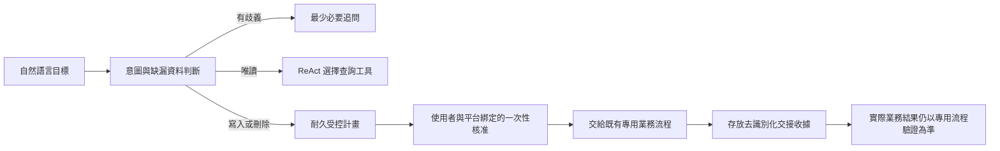
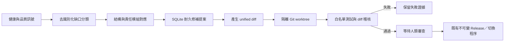

# MAGI V3 受控自主 Agent

## 目標

MAGI 先理解使用者想完成的結果，再選擇必要的查詢、分析與專用業務流程。自主不等於任意寫入：模型只能自行執行唯讀工具，任何寫入、上傳、送出或刪除都必須經過可驗證的專用流程。

## 安全與耐久性合約

- 計畫存在 SQLite，使用 WAL、`FULL` 同步與交易，Web、OSC、LINE、Telegram 與 Discord 可共用同一正式狀態。
- 計畫綁定使用者與平台；其他使用者或平台無法讀取或核准。
- 核准碼僅顯示給使用者，資料庫只存雜湊；核准碼一次性且預設 30 分鐘過期。
- 同一目標在核准前重複送出時會沿用原計畫並更換核准碼，不產生重複工作。
- 核准後最多交接一次。程序若在交接期間中斷，15 分鐘後標記為需對專用流程進行核對，不會盲目重放可能的寫入。
- 收據只存回覆雜湊、交接狀態與是否具備業務完成證據，不存回覆內容、工具參數、當事人資料或內部推理。

## 使用方式

- 直接交代目標，例如「查明這件案件最近的法院文件與期限」。
- 唯讀工作會直接選擇工具；可變更工作會回傳計畫編號與一次性核准碼。
- `確認自主計畫 <計畫編號> <一次性核准碼>`
- `列出自主計畫`
- `自主計畫狀態 <計畫編號>`
- `取消自主計畫 <計畫編號>`

## 完成範圍

受控計畫的 `succeeded` 只代表「已安全交給已登錄的專用流程並記錄收據」，絕不代表法扶申報、卷宗下載、筆錄同步、日曆寫入或檔案變更已經完成。各業務的完成仍必須有該專用流程的驗證證據。

## 受控自我演化

MAGI 的自我修復分成兩層，不能混用：

1. 已知且低風險的 Runtime 修復，由 guardian 依所有權證據自動處理。
2. 涉及程式碼或品質規則的問題，只能建立「受控演化候選」。

安全界線：

- 診斷資料進入演化帳本前會移除摘要、證據、路徑、使用者內容及例外字串，只保留雜湊參照與原因分類。
- 修補只能改動提案所屬模組的白名單路徑；密鑰、Runtime、有效版本標記、匯出檔、二進位 patch、危險 shell 呼叫與跨目錄修改會被拒絕。
- 候選只能建立在隔離 Git worktree；資源不足時安全延後，不與互動工作爭用硬體。
- 候選必須通過模組專屬回歸與 `git diff --check`，失敗時不得進入審查狀態。
- 控制器沒有部署 API。即使驗證通過，也只能標記為 `ready_for_human_review`；正式上線仍須使用原有不可變 release、原子切換及回滾程序。
